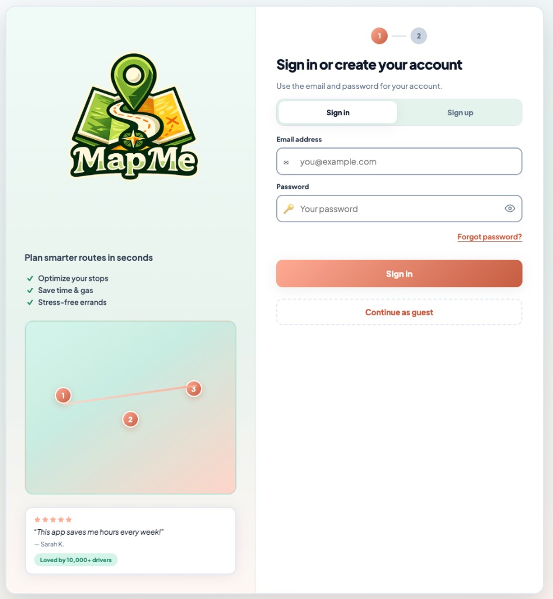
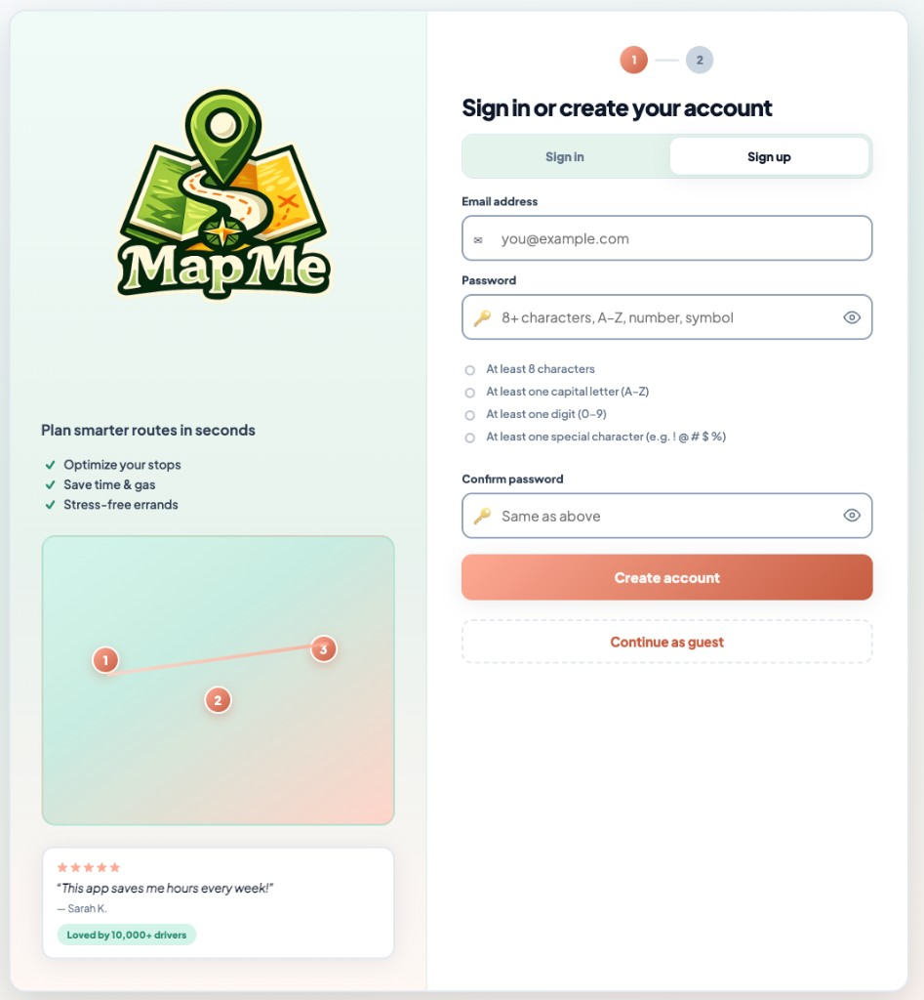

# 1. Sign up & sign in

MapMe opens on the **home** screen (`/`): marketing content on the left and account actions on the right. From here you can **sign in**, **create an account**, or **continue as a guest** (guests go straight to the Planner — see [chapter 5](./05-user-vs-non-user.md)).

## Progress indicator

At the top you may see steps **1** and **2**:

- **Step 1** — Email and password (sign in or sign up).
- **Step 2** — First-time setup after a new account (or if your profile is incomplete): your **display name** and **how you move** (travel modes). When that is complete, MapMe sends you to the Planner.

If you already finished onboarding earlier, signing in skips step 2 and opens the Planner directly.

## Sign in

1. Leave the **Sign in** tab selected (or select it if you are on **Sign up**).
2. Enter your **email address** (the app normalizes it for consistency with the server).
3. Enter your **password**. Use the eye control if you want to reveal the password only while you hold the control.
4. Click **Sign In**.

If something is wrong (wrong password, unknown email, or network issues), an error message appears above the form.

### Forgot password

1. Click **Forgot password?**
2. Enter your email and submit. MapMe asks Supabase to send a recovery message.
3. Use the link in the email to open the **reset password** page, set a new password that meets the same rules as sign-up, then sign in with the new password.

Your project administrator must configure the correct **redirect URL** in Supabase for password reset links to return to this app.

## Sign up (create an account)

1. Select the **Sign up** tab.
2. Enter your **email address**.
3. Choose a **password** that satisfies **all** checklist items shown on the screen:

   - At least **8 characters**
   - At least one **capital letter** (A–Z)
   - At least one **digit** (0–9)
   - At least one **special character** (for example `! @ # $ %`)

4. Enter the same password again under **Confirm password**.
5. Click **Create account**.

**What happens next depends on your Supabase project settings:**

- If email **confirmation** is required, you will see a message that explains you must **confirm your email** before you can sign in. Open the message from your inbox and follow the link, then return and use **Sign in**.
- If Supabase returns an active session immediately, you may go straight to **step 2** (name + travel modes) or to the Planner if that metadata already exists.

## Step 2 — Name and how you move

After a successful sign-up or sign-in, if your profile metadata is incomplete, you will see the second step:

- Enter your **full name** (or display name) as you want it to appear in the app.
- Pick one or more **travel modes** (for example **Driving** and **Public transportation**). At least one mode must stay selected.

Submit to finish. MapMe then opens the **Planner** at `/routeoptimizer`.

(On this screen you set **display name** and **travel modes**; the exact layout matches the orange **2** step in the progress indicator at the top of the auth panel.)

## Continue as guest

At the bottom of the right panel, **Continue as guest** skips account creation and opens the Planner. Guests cannot use cloud **History** or full **Profile** features until they sign in. Details are in [chapter 5](./05-user-vs-non-user.md).

## Sign out

When you are signed in, use **Sign out** from the sidebar footer (on Planner, History, or Profile). You return to the sign-in experience on `/`.

## If Supabase is not configured

If the host has not set `VITE_SUPABASE_URL` and `VITE_SUPABASE_ANON_KEY`, the app shows a short notice and you cannot use email sign-in. You may still use **Continue as guest** for local planning when the backend is available.
