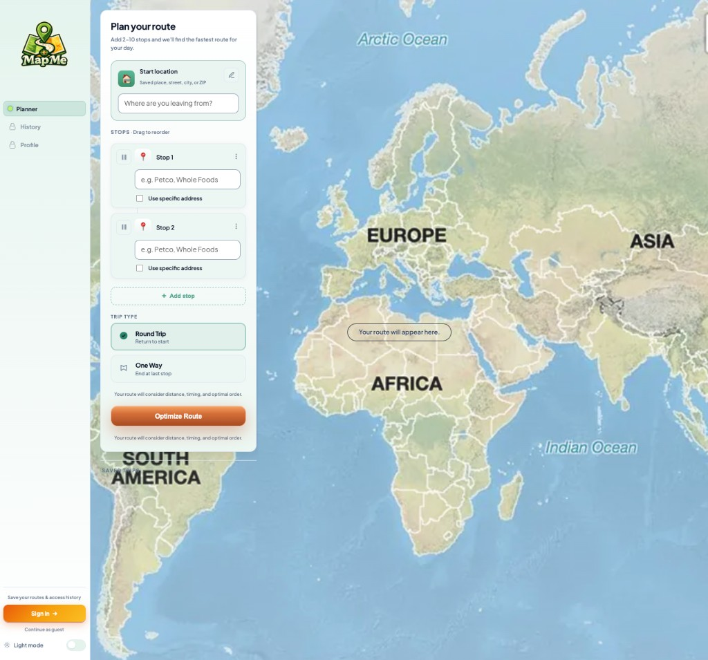
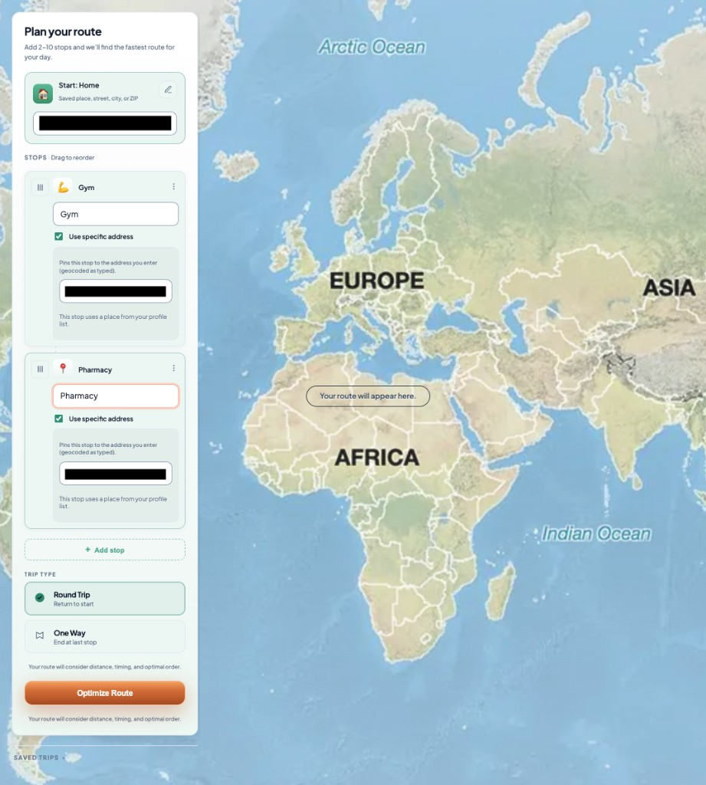
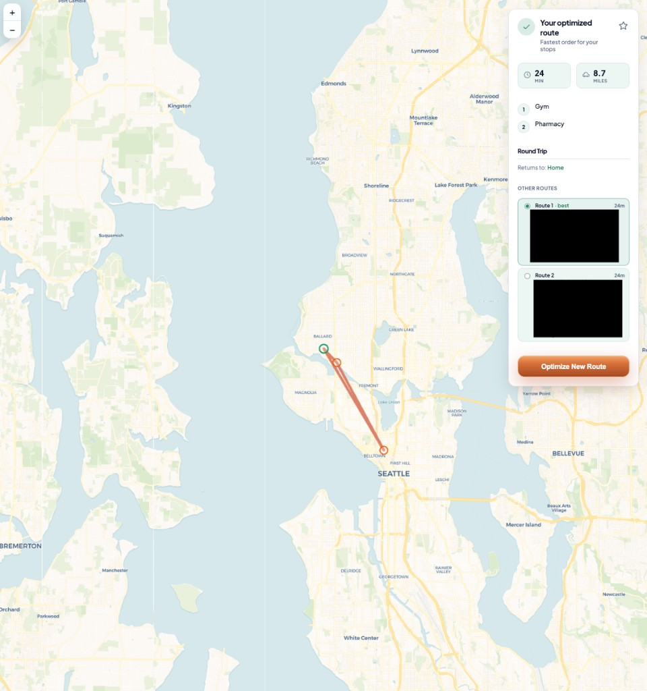

# 2. Planner

The **Planner** is where you set your **start location**, add **2–10 stops**, choose **round trip** or **one way**, and run **Optimize Route**. The map shows your path and timing after optimization.

Open it from the sidebar **Planner** item (URL: `/routeoptimizer`).

## Layout

- **Left:** “Plan your route” panel — inputs and trip type.
- **Right:** Interactive map. Before optimization, you may see a hint such as “Your route will appear here.” After optimization, the route draws on the map and a **summary card** appears with times, distance, and alternatives.

## Start location

- The **Start** row is where you begin (for example **Home** or a custom label).
- You can type a **saved place**, **street**, **city**, or **ZIP**, or pick from suggestions as you type.
- Use the **edit** control if you need to change the start label or field.

**Signed-in users** with places saved on **Profile** can select those quickly. Guests rely on typed addresses and suggestions only.

## Stops (2–10)

- You need **at least two stops** and **at most ten**.
- Each stop has a **name** field (store name, chain, or short description). You can turn on **Use specific address** to pin the stop to an exact address; the server **geocodes** what you enter.
- **Drag the handle** on each row to **reorder** stops before optimizing. Order matters for “fixed” legs; optimization still proposes the best visit order in the result.
- Click **+ Add stop** until you have all destinations.

If a stop is tied to your **profile list**, the UI may note that so you know it came from saved places.

## Trip type

- **Round trip** — After visiting all stops in the optimized order, the route **returns to the start** (your start location).
- **One way** — The route **ends at the last stop** in the chosen ordering (or at a fixed end, depending on server rules for your trip).

Select the mode that matches your day before you optimize.

## Optimize Route

1. Confirm start and stops are filled in correctly (and addresses, if you use “Use specific address”).
2. Click **Optimize Route**.

The app sends your trip to the MapMe **backend**. While it runs, the button may show a loading state. When finished:

- The **map** shows markers and the path.
- The **summary panel** shows **estimated time**, **distance**, ordered **stops**, **round trip** / end information, and often **other route options** you can compare.

### Summary panel actions

- **Star (favorite)** — When signed in and the service is configured, you can mark the current result as a **saved** trip. If the star is disabled, hover the tooltip (for example when browsing as a guest).
- **Other routes** — Switch between alternatives (for example “Route 1 — best” vs “Route 2”) to compare minutes and paths.
- **Optimize New Route** — Clears the current result and returns you to the input state to plan another trip.

## Saved trips (sidebar)

Signed-in users see a **Saved trips** area on the Planner that lists **favorited** routes. You can open one to reload that plan into the planner context (depending on app version and data). This ties closely to **History** and starring — see [chapter 3](./03-history.md).

## Tips

- Use **clear, specific names** for stops (“Whole Foods Ballard” vs “grocery”) for better geocoding.
- If results look wrong, check the **start** ZIP or city and try **Use specific address** on ambiguous stops.
- The route engine considers **distance**, **travel time**, and **stop order**; exact drive times can still differ from real traffic.

## Backend

Optimization needs the **MapMe API** running or deployed. If requests fail, confirm your environment uses the correct **`VITE_API_URL`** (or the default `http://localhost:8000` in development). See the developer README for setup.
