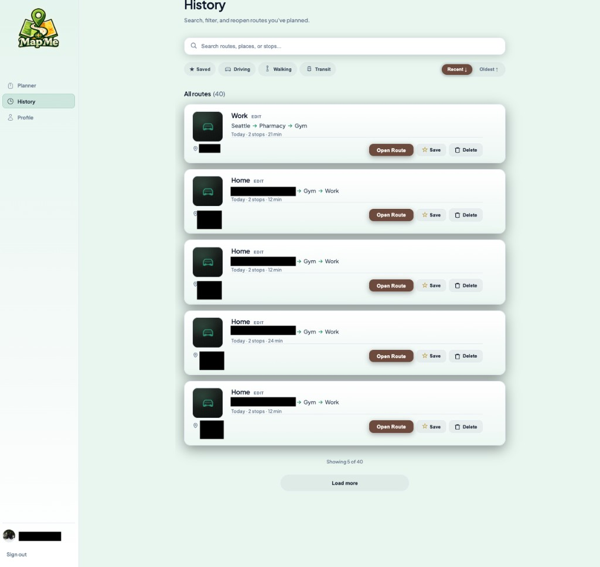

# 3. History

**History** is your archive of routes you planned while signed in. You can **search**, **filter**, **sort**, **reopen** a route on the map, **save** (star) trips for quick access, and **delete** ones you no longer need.

## Who can use History

Only **signed-in** users with a working Supabase configuration can open **History**. Guests see **History** in the sidebar with a **lock** and the hint “Sign in to access.”

Path in the app: `/route-history`.

## Page overview

- **Title:** History  
- **Subtitle:** Explains that you can search, filter, and reopen past routes.

## Search and filters

- **Search bar** — Type part of a **route title**, **place name**, or **stop** to narrow the list.
- **Filter chips** — Typical filters include **Saved** (favorites), **Driving**, **Walking**, and **Transit**, matching how trips were planned or stored.
- **Sort** — Toggle **Recent** (newest first) vs **Oldest** so you can browse chronologically.

## Route cards

Each row summarizes one saved trip:

- **Mode icon** — Driving, walking, or transit indicator.
- **Title** — Name of the route; **Edit** starts renaming; use **Save name** to confirm or cancel out.
- **Path summary** — Stops in order, often shown with arrows (for example `Seattle → Pharmacy → Gym`).
- **Meta** — When it was created (“Today,” a date), **number of stops**, and **estimated time**.
- **Start / location** — May show the starting area or pin context.

### Actions on a card

- **Open Route** — Loads that trip back into the **Planner** experience so you can review it on the map or tweak it.
- **Save** / **Unsave** — Toggles the trip as a **saved favorite** (starred routes show in **Saved** filters and Planner **Saved trips**).
- **Delete** — Removes the trip from your history (this cannot be undone from the UI).

## Pagination

At the bottom, text such as **“Showing 5 of 40”** tells you how many items are visible. **Load more** fetches the next page of results when you have many trips.

## Relationship to the Planner

- Trips you **star** from the **optimized route** summary often appear as **saved** in History and in the Planner sidebar list.
- **Open Route** is the fastest way to **reuse** a past plan instead of retyping stops.

If History is empty, plan and optimize routes while signed in, then use **Save** / star where available.
