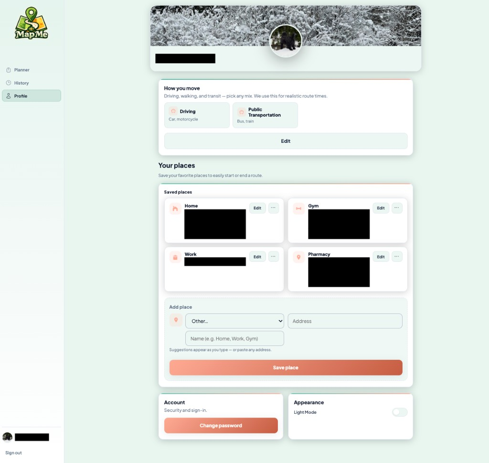

# 4. Profile

The **Profile** page is where signed-in users manage **identity**, **travel preferences**, **saved places**, **password**, and **appearance**. In the sidebar, **Profile** is highlighted when you are on this screen (`/profile`).

## Who can open Profile

**Signed-in** users only. Guests see **Profile** locked in the sidebar (“Sign in to access”). Path: `/profile`.

## Header (banner and photo)

- **Cover banner** — Wide image across the top of the main area; update it where the UI offers upload or edit (stored in your project’s file storage when configured).
- **Profile photo** — Circular picture overlapping the bottom of the banner.
- **Display name** — Shown on the bar below the avatar; usually matches the name from onboarding and can be updated where the app allows.

## How you move

Intro text explains that **driving, walking, and transit** can be combined and that MapMe uses this for realistic route times.

- **Mode cards** — For example **Driving** (“Car, motorcycle”) and **Public transportation** (“Bus, train”), shown as selectable cards when you edit.
- **Edit** — Opens the flow to change which modes are on. At least one mode must stay selected, same as during sign-up onboarding.

Changes here affect how the app describes and plans trips that depend on mode metadata.

## Your places (saved places)

Saved places are shortcuts for the **Planner** start field and stops (for example **Home**, **Work**, **Gym**, **Pharmacy**).

### Existing cards

Each card usually shows:

- An **icon** and **label** (place type or name).
- The **address** (may be partially hidden in screenshots).
- **Edit** — Update name or address.
- **More (…)** — Extra actions such as remove, depending on implementation.

### Add a new place

1. Choose a **category** (or **Other…**) if offered.
2. Enter the **address** (suggestions appear as you type; you can also paste a full address).
3. Enter a short **name** you will recognize (for example “Home”, “Gym”).
4. Click **Save place**.

After saving, the place should appear in the grid and in **Planner** pickers.

## Bottom row: Account and Appearance

Two compact cards sit side by side at the bottom of the Profile main area.

### Account — security

- Subtitle: **Security and sign-in.**
- **Change password** — Opens a flow to set a new password. You typically confirm your **current** password, then enter a **new** one that meets the same rules as sign-up (length, uppercase, digit, special character).

If you use **Forgot password** from the sign-in screen instead, follow the email link (see [chapter 1](./01-sign-up-sign-in.md)).

### Appearance

- **Light Mode** — Toggle for light vs dark presentation for the whole app. Your choice may be remembered on this device.

## Sign out

Use **Sign out** in the sidebar footer to leave your account and return to the home `/` screen.

## Privacy note

Profile images and addresses are tied to **your** Supabase account and project policies. Do not upload sensitive documents as banner or avatar images unless your organization approves.
